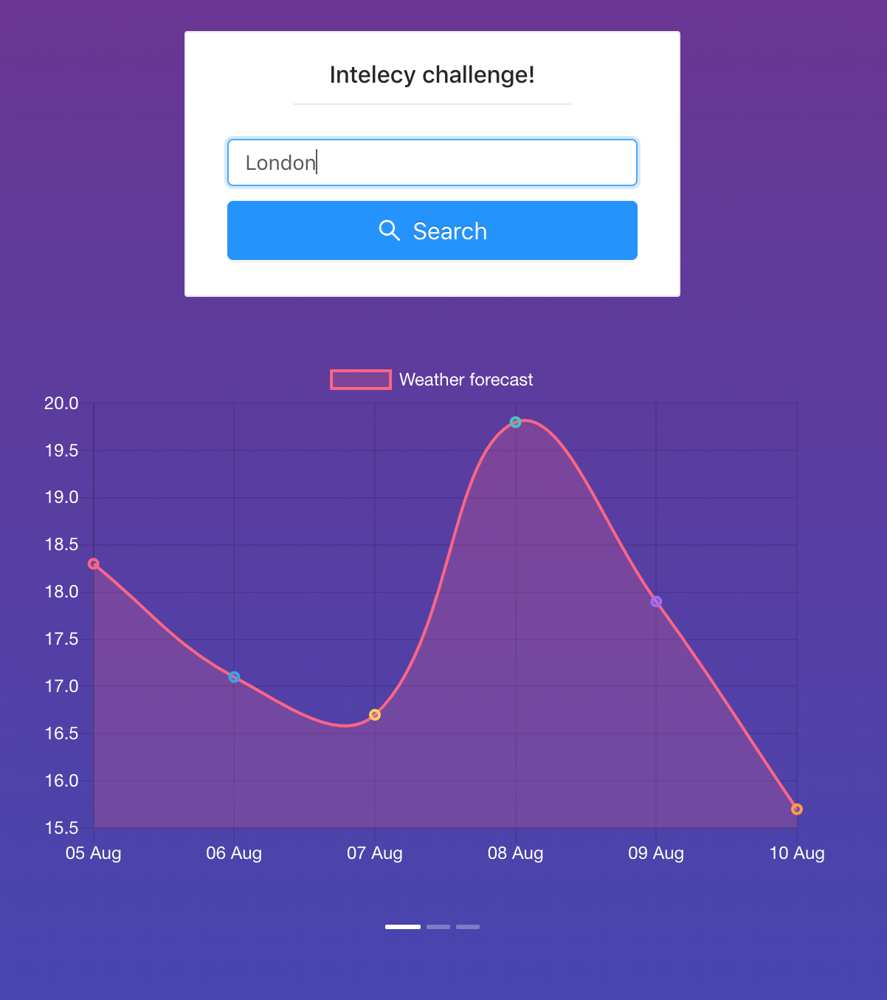

# Weather test app

The most accurate weather forecast for the next 5 days. You don't need more because a loss of accuracy.

- Minimalistic design.
- No redundant info.

# Installation

### General

- install [node.js](https://nodejs.org/en/)
- install [npm](https://www.npmjs.com)

### Clone repository

```bash
git clone https://github.com/vtolochk/weather_test.git
```

### Installing packages
 
Navigate to project root and do `yarn install` to install all required NPM packages

### Starting application

```bash
yarn start
```

# Project structure

- `/preview` - images for GitHub preview
- `/public` - static files
- `/src` - `JS` source code
    - `/components` - re-usable and silly components with low level of logic
    - `/configs` - global application configs
    - `/constants` - list of unchangeable constants
    - `/containers` - components with logic and `Redux` connection
    - `/helpers` - number of re-usable helper function
    - `/navigation` - `react-navigation` package defined routes and navigators
    - `/normalizers` - data convertors functions
    - `/redux` - `Redux` module
    - `/sagas` - `Saga` module 
    - `/validators` - data validators

# Contributors
This small app is completly open source, so the `.env` file available in the repo.
Please do not use it for other projects!

## Preview


